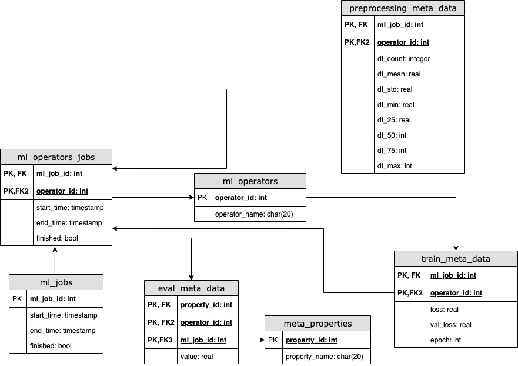

# Dockerized ML pipeline of the "Basic regression: Predict fuel efficiency"  
  
Original jupyter notebook could be obtained [here](https://www.tensorflow.org/tutorials/keras/regression)  

# Summary of the project  
The project is expected to be a scalable ML pipeline solution based on a pipeline manager MLPipeline and the ML operators. The main entrypoint in main.py includes the operators' configurations to increase flexibility of the process. A more specific explanation of the configurations could be found in the particular classes.    
# Execution  
To execute the whole pipeline please execute init.sh (please contact me if a Windows version required).  
This pipeline contains of the following stages:  
* Cleaning of the original .data file to be consumable by postgreSQL  
* Creating of a PostgreSQL container
* Creating of a Python container

# Data model  
The data model is shown on the image below. Alternatively, it is also possible to extend it by saving the execution parameters, and it could be done for the specific needs.  
  
The data model is created automatically with a docker script.  

# Unit tests  
Currently, the project includes only a few examples of the unit tests that are going to be extended when the more concrete needs could be specified.  

# Example of a query  
### Fetch all models that were trained in the last week with a Mean Absolute Error (MAE) of less than 2.5
``` 
SELECT mo.operator_name, emd.ml_job_id, emd.metrics_value
 FROM mlmeta.evaluation_meta_data AS emd, mlmeta.ml_operators AS mo,
 mlmeta.evaluation_metrics AS em, mlmeta.ml_operators_jobs AS emj 
 WHERE metrics_value < 2.5
 AND emd.metrics_id = em.metrics_id
 AND em.property_name = 'MAE'
 AND emj.operator_id = emd.operator_id
 AND emj.end_time >= current_date - interval '7 days'
 AND emd.operator_id = mo.operator_id
 ;
 ```